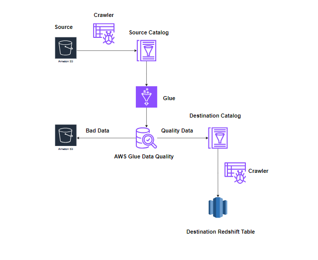

# Netflix Data Quality Check ETL

This project demonstrates an ETL process for checking the quality of Netflix data using AWS Glue, S3, and Redshift. The architecture ensures data quality by filtering out bad data and loading high-quality data into Redshift.

## Architecture Overview
1. **Source (S3)**: Raw data storage.
2. **AWS Glue Crawler**: Crawls source data to infer schema.
3. **AWS Glue ETL Job**: Transforms and cleans data.
4. **AWS Glue Data Quality**: Filters and removes bad data.
5. **Destination (S3)**: Stores quality-approved data.
6. **AWS Glue Crawler**: Crawls quality data for schema updates.
7. **Redshift**: Stores final quality data for analytics.
